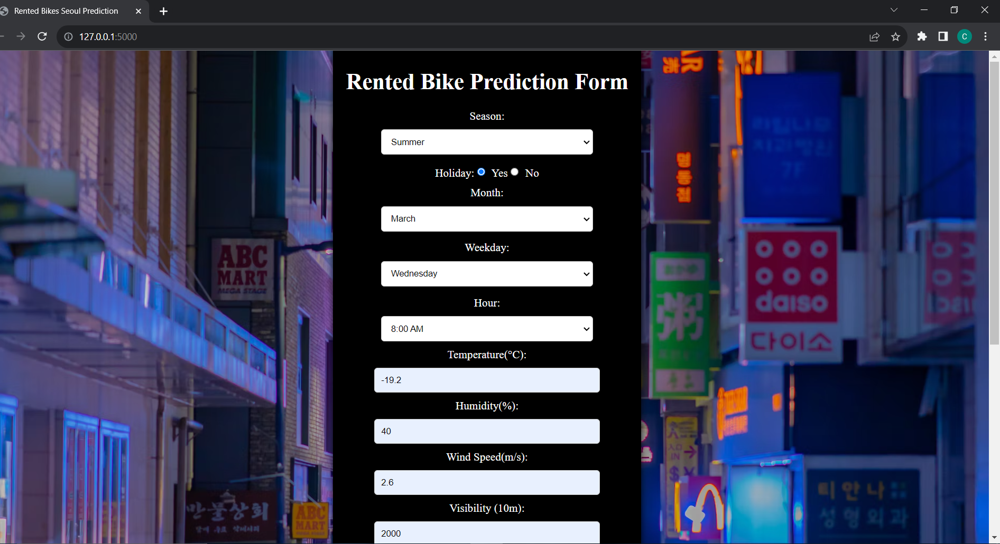
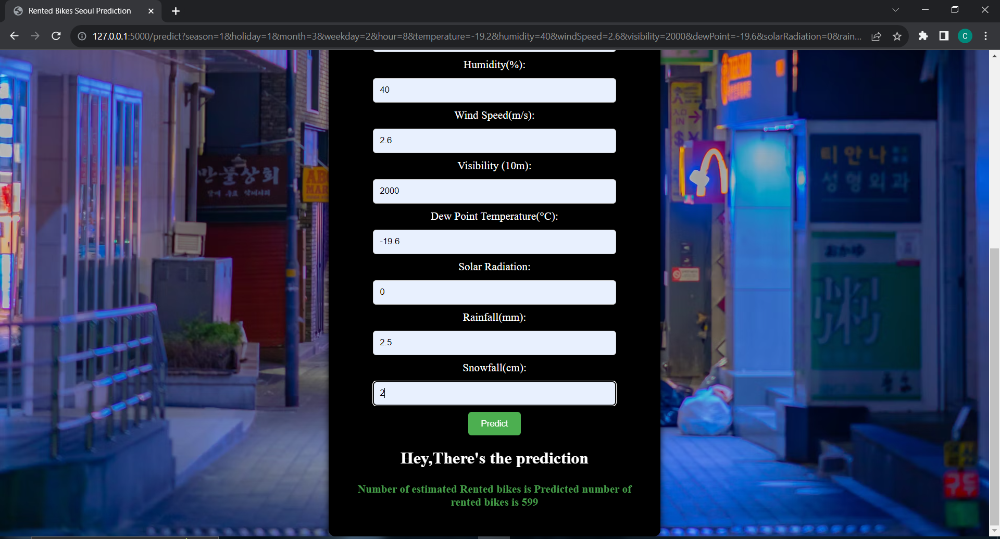

## About Dataset 🔍

**The Seoul Bike Demand Prediction project aims to forecast the demand for bike rentals in Seoul, South Korea. This predictive analysis is crucial for bike-sharing service providers to optimize their resources, enhance user experience, and meet the increasing demand for eco-friendly transportation. The dataset spans from 2017 to 2018 and includes various features related to weather conditions, time, and bike usage patterns.**

## Dataset - [Dataset Link](https://archive.ics.uci.edu/dataset/560/seoul+bike+sharing+demand)

## Information about Dataset Features
- Date : year-month-day
-Rented Bike count - Count of bikes rented at each hour
- Hour - Hour of he day
- Temperature-Temperature in Celsius
- Humidity - %
- Windspeed - m/s
- Visibility - 10m
- Dew point temperature - Celsius 
- Solar radiation - MJ/m2
- Rainfall - mm
- Snowfall - cm
- Seasons - Winter, Spring, Summer, Autumn
- Holiday - Holiday/No holiday
- Functional Day - NoFunc(Non Functional Hours), Fun(Functional hours)

## Libraries Used 
- [Pandas](https://pandas.pydata.org/)
- [Numpy](https://numpy.org/)
- [Matplotlib](https://matplotlib.org/)
- [Seaborn](https://seaborn.pydata.org/)
- [Scikit Learn Models](https://scikit-learn.org/)
- [Flask](https://flask.palletsprojects.com/)

## Project Flow 📚
- Exploratory Data Analysis
- Data Visualization
- Outlier Analysis and Filtering
- Correlation Analysis
- Data Transformation
- Applying different Regression Models like Random ForestRegressor, Support Vector Regressor, Linear Regression and Ridge.
- Accuracy Comparision between all models.
- HyperParameter Tuning
- Saving Model in Pickle File Format
- Providing a Web Interface for deploying Model

## Screenshots 📷
### Input Screen:

### Output Screen:
